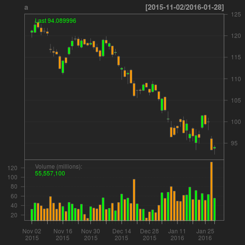

Stock Analyzer
========================================================
author: rdcousera   
date: 1/30/2016

Background and purpose
========================================================

This application was built to explore some of the features of the quantmod package.

* It shows the default "chartseries" plot of a given stock symbol as well as the raw data used to plot it (on a separate tab).  
* There are radio buttons to select the different chart features (candlestick, etc). 
* There is also a select box to add indicators such as bollingerbands.

Quantmod basics - retrieving data
========================================================

Quantmod is a package that facilitates time series analysis of stocks.  The following is an example of retrieving the historical data for the symbol "AAPL".  It is returned in an xts object with the date an index to each line. 

```r
library(quantmod)
a <- getSymbols("AAPL",auto.assign = FALSE)
kable(head(data.frame(date = index(a),coredata(a)),n = 2L))
```


|date       | AAPL.Open| AAPL.High| AAPL.Low| AAPL.Close| AAPL.Volume| AAPL.Adjusted|
|:----------|---------:|---------:|--------:|----------:|-----------:|-------------:|
|2007-01-03 |     86.29|     86.58|    81.90|      83.80|   309579900|      11.14677|
|2007-01-04 |     84.05|     85.95|    83.82|      85.66|   211815100|      11.39418|

Quantmod basics - charting data
========================================================


